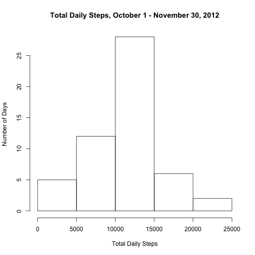
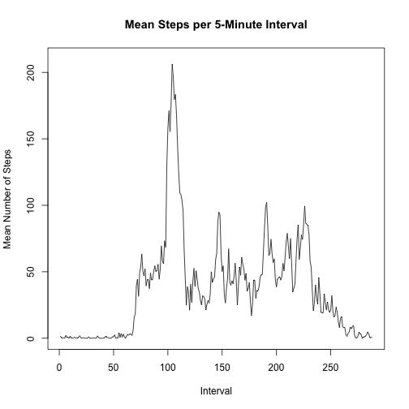
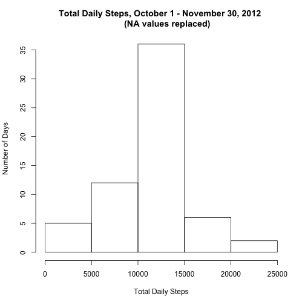
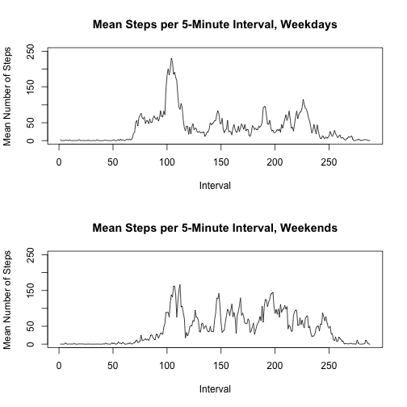

Analysis of Activity Data: Step Counts 
======================================
This analysis examines activity data in the form of step counts measured over the course of 61 days, from October 1, 2012, to November 30, 2012. 

## Loading and preprocessing the data
The dataset for this report is located within a compressed file called "activity.zip". The first step in the analysis is to extract the dataset from the compressed file and to create an R data frame called <strong>activity</strong> containing the full dataset. <em>Note: Make sure that "activity.zip" is in the working directory.</em>


```r
activity <- read.csv(unz("activity.zip", "activity.csv"))
library(plyr)
activity <- mutate(activity, interval=c(1:288))
summary(activity)
```

```
##      steps                date          interval     
##  Min.   :  0.00   2012-10-01:  288   Min.   :  1.00  
##  1st Qu.:  0.00   2012-10-02:  288   1st Qu.: 72.75  
##  Median :  0.00   2012-10-03:  288   Median :144.50  
##  Mean   : 37.38   2012-10-04:  288   Mean   :144.50  
##  3rd Qu.: 12.00   2012-10-05:  288   3rd Qu.:216.25  
##  Max.   :806.00   2012-10-06:  288   Max.   :288.00  
##  NA's   :2304     (Other)   :15840
```

## What is mean total number of steps taken per day?

The dataset includes observations of the number of steps taken during 5 minute intervals over 61 days, from October 1, 2012, to November 30, 2012. The data frame <strong>dailySteps</strong> contains the total number of steps taken each day.


```r
dailySteps <- aggregate(activity[ ,1], list(activity$date), sum)
colnames(dailySteps) <- c("Date", "Total.Steps")
summary(dailySteps)
```

```
##          Date     Total.Steps   
##  2012-10-01: 1   Min.   :   41  
##  2012-10-02: 1   1st Qu.: 8841  
##  2012-10-03: 1   Median :10765  
##  2012-10-04: 1   Mean   :10766  
##  2012-10-05: 1   3rd Qu.:13294  
##  2012-10-06: 1   Max.   :21194  
##  (Other)   :55   NA's   :8
```

The histogram below shows ranges of the total number of steps taken per day and the number of days for which total steps fall into each range.  


```r
stepTotals <- dailySteps$Total.Steps
hist(stepTotals, main="Total Daily Steps, October 1 - November 30, 2012", xlab="Total Daily Steps", ylab="Number of Days")
```

 

As shown below, the mean daily step total is just over 10,766 steps per day. The median daily step total is 10,765 steps per day.


```r
mean(stepTotals, na.rm=TRUE)
```

```
## [1] 10766.19
```

```r
median(stepTotals, na.rm=TRUE)
```

```
## [1] 10765
```

## What is the average daily activity pattern?

Step counts are measured over 5-minute intervals throughout the day. The time series plot below shows the mean number of steps taken during each 5-minute interval over all days in the dataset. In this plot, each 5-minute interval is numbered from 1 to 288; Interval 1 corresponds to the time between midnight and 12:05 a.m., Interval 2 corresponds to 12:05 to 12:10 a.m., and Interval 288 corresponds to 11:55 p.m. to midnight.


```r
## Calculate mean number of steps taken during each interval across dataset.
avgInterval <- aggregate(activity[ ,1], list(activity$interval), mean, na.rm=TRUE)
colnames(avgInterval) <- c("Interval", "Mean.Steps")
## Plot mean number of steps for each interval.
plot(avgInterval$Interval, avgInterval$Mean.Steps, type="l", xlim=c(1,288), ylim=c(0, 210), main="Mean Steps per 5-Minute Interval", xlab="Interval", ylab="Mean Number of Steps")
```

 

The interval averaging the largest number of steps over all days in the dataset is Interval 104, corresponding to the timeframe between 8:35 a.m. and 8:40 a.m. On average, approximately 206 steps are taken each day during this timeframe.


```r
avgInterval[which(avgInterval$Mean.Steps==max(avgInterval$Mean.Steps)), ]
```

```
##     Interval Mean.Steps
## 104      104   206.1698
```

## Imputing missing values

There are a number of days and intervals throughout the dataset for which no step counts are available. Missing step counts are denoted by a value of "NA" in the dataset. As shown below, there are 2,304 intervals in the dataset for which no step counts are available.


```r
missingData <- activity[which(is.na(activity$steps)), ]
nrow(missingData)
```

```
## [1] 2304
```

To reduce the possibility of biased calculations due to these missing values, each "NA" value will be replaced with the mean number of steps taken during the corresponding time interval over the course of the dataset.  

The new data frame <strong>activityAllValues</strong> contains all measured step count values from the original dataset and replaces all "NA" values with the mean number of steps for the corresponding interval. 


```r
activityAllValues <- activity
for (i in 1:length(activityAllValues$steps)) {
      if (is.na(activityAllValues$steps[i])==TRUE) {
            activityAllValues$steps[i] = avgInterval$Mean.Steps[activity$interval[i]]     
      }
}
summary(activityAllValues)
```

```
##      steps                date          interval     
##  Min.   :  0.00   2012-10-01:  288   Min.   :  1.00  
##  1st Qu.:  0.00   2012-10-02:  288   1st Qu.: 72.75  
##  Median :  0.00   2012-10-03:  288   Median :144.50  
##  Mean   : 37.38   2012-10-04:  288   Mean   :144.50  
##  3rd Qu.: 27.00   2012-10-05:  288   3rd Qu.:216.25  
##  Max.   :806.00   2012-10-06:  288   Max.   :288.00  
##                   (Other)   :15840
```

The histogram below shows the number of days for which total daily steps fall into each of five ranges, using recalculated total daily step counts that include the replaced NA values. Replacing the NA values increased the total number of steps counted for each day, and it added data for eight full days that were excluded from the first histogram above because step counts for all intervals on those days had NA values.


```r
dailySteps2 <- aggregate(activityAllValues[ ,1], list(activityAllValues$date), sum)
colnames(dailySteps2) <- c("Date", "Total.Steps") 
stepTotals2 <- dailySteps2$Total.Steps
hist(stepTotals2, main="Total Daily Steps, October 1 - November 30, 2012 
     (NA values replaced)", xlab="Total Daily Steps", ylab="Number of Days")
```

 

Replacing the NA values did not change the mean daily total step count of just over 10,766 steps per day across the full dataset. However, it did change the median daily total step count from 10,765 to 10,766.19, matching the mean.


```r
mean(stepTotals2, na.rm=TRUE)
```

```
## [1] 10766.19
```

```r
median(stepTotals2, na.rm=TRUE)
```

```
## [1] 10766.19
```

## Are there differences in activity patterns between weekdays and weekends?

To determine how step counts vary between weekdays and weekends, two additional columns are added to the <strong>activityAllValues</strong> dataframe. The 'day' column indicates the day of the week on which the measurement was made. The 'weekday.weekend' column indicates whether that day is a weekday or a weekend.


```r
## Convert 'date' column values to date format
activityAllValues$date <- as.Date(activityAllValues$date)
## Add 'day' column to data frame indicating day of the week for each measurement.
## Add 'weekday.weekend' column to dataframe indicating whether 'day' value is a weekday or weekend. 
activityAllValues <- mutate(activityAllValues, day=weekdays(activityAllValues$date), weekday.weekend="Weekday")
weekend <- c("Saturday", "Sunday")
activityAllValues$weekday.weekend[activityAllValues$day %in% weekend] = "Weekend"
activityAllValues$weekday.weekend <- as.factor(activityAllValues$weekday.weekend)
summary(activityAllValues)
```

```
##      steps             date               interval          day           
##  Min.   :  0.00   Min.   :2012-10-01   Min.   :  1.00   Length:17568      
##  1st Qu.:  0.00   1st Qu.:2012-10-16   1st Qu.: 72.75   Class :character  
##  Median :  0.00   Median :2012-10-31   Median :144.50   Mode  :character  
##  Mean   : 37.38   Mean   :2012-10-31   Mean   :144.50                     
##  3rd Qu.: 27.00   3rd Qu.:2012-11-15   3rd Qu.:216.25                     
##  Max.   :806.00   Max.   :2012-11-30   Max.   :288.00                     
##  weekday.weekend
##  Weekday:12960  
##  Weekend: 4608  
##                 
##                 
##                 
## 
```

The plots below show the mean number of steps taken during each 5-minute interval on weekdays versus weekends.


```r
## Create new dataframe containing only weekday data and calculate mean number of steps for each interval.
activityWeekday <- activityAllValues[which(activityAllValues$weekday.weekend=="Weekday"), ]
avgIntervalWeekday <- aggregate(activityWeekday[ ,1], list(activityWeekday$interval), mean, na.rm=TRUE)
colnames(avgIntervalWeekday) <- c("Interval", "Mean.Steps")
## Create new dataframe containing only weekend data and calculate mean number of steps for each interval.
activityWeekend <- activityAllValues[which(activityAllValues$weekday.weekend=="Weekend"), ]
avgIntervalWeekend <- aggregate(activityWeekend[ ,1], list(activityWeekend$interval), mean, na.rm=TRUE)
colnames(avgIntervalWeekend) <- c("Interval", "Mean.Steps")
## Plot mean steps taken in each interval for weekdays and weekends.
par(mfcol=c(2,1))
plot(avgIntervalWeekday$Interval, avgIntervalWeekday$Mean.Steps, type="l", xlim=c(1,288), ylim=c(0, 250), main="Mean Steps per 5-Minute Interval, Weekdays", xlab="Interval", ylab="Mean Number of Steps")
plot(avgIntervalWeekend$Interval, avgIntervalWeekend$Mean.Steps, type="l", xlim=c(1,288), ylim=c(0, 250), main="Mean Steps per 5-Minute Interval, Weekends", xlab="Interval", ylab="Mean Number of Steps")
```

 

The plots show that on weekdays, the number of steps per time interval spikes earlier in the day compared to weekends, when the steps are more evenly distributed throughout the day.
